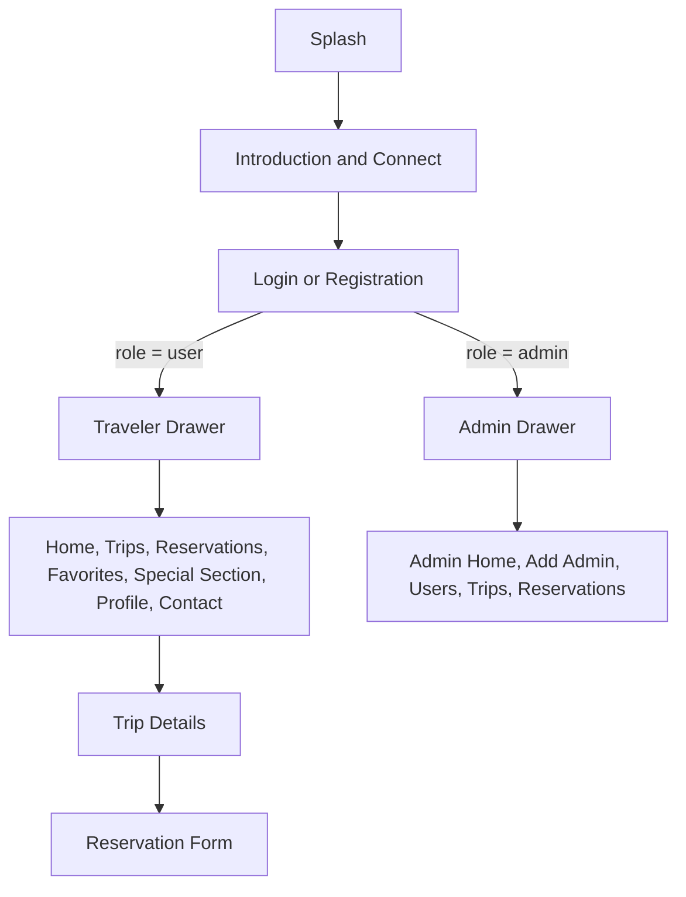

# Discussion Notes

These notes are a concise guide for the project demonstration and instructor discussion.

## 1. What the App Does

`1220216_1220071_CourseProject` is a Travel Planner App with a Left Theme. A traveler connects to the REST dataset, creates an account, browses and filters trips, opens details, saves favorites, makes reservations, views special recommendations, manages a profile, and contacts support. An administrator signs into a separate protected area to manage admins, users, trips, and reservations.

## 2. Navigation Structure



- `SplashActivity` displays the animation, then opens `IntroductionActivity`.
- Introduction permits progress only after a successful import of at least 10 usable trips.
- Login reads the stored role and clears the previous task while routing to `MainActivity` or `AdminHomeActivity`.
- The traveler drawer tracks its selected root destination. Details and reservation forms use a nested back stack; choosing a drawer item clears stale nested entries.
- User and admin menus are separate resources, so admin-only destinations never appear in the traveler drawer.
- Logout clears SharedPreferences and starts Login with a new cleared task, preventing Back from reopening protected screens.

## 3. Database Structure

The app uses one SQLite database, `travel_planner.db`, with four tables:

- `users`: account/profile data, password hash, `user`/`admin` role, and soft-delete state.
- `trips`: local/remote IDs, destination, country, duration, price, rating, description, image URL, and soft-delete state.
- `favorites`: unique `(user_id, trip_id)` pairs.
- `reservations`: user/trip IDs, traveler quantity, reservation type/date/status, and optional notes.

Relationships:

```text
users 1 ──< favorites >── 1 trips
users 1 ──< reservations >── 1 trips
```

Repositories isolate database access from activities/fragments: `UserRepository`, `TripRepository`, `FavoriteRepository`, and `ReservationRepository`. Users and trips are soft deleted by setting `is_active = 0`, which preserves historical reservation/favorite rows.

## 4. API Integration Flow

1. Connect disables itself and shows a progress indicator.
2. `ConnectionAsyncTask` calls `HttpManager.getData()` on a background thread.
3. `HttpManager` performs a timeout-protected HTTP GET.
4. `TripJsonParser` validates required fields and sensible values. One malformed item is skipped without discarding later valid items.
5. Introduction rejects null, empty, invalid, or fewer-than-10 usable results and restores retry controls.
6. `TripRepository.importTrips()` inserts new `api_id` values and refreshes matching existing trips.
7. Introduction confirms at least 10 active trips are stored, then opens Login.

## 5. Validation Rules

- Email: required and must match a normal email structure; stored normalized to lowercase.
- First/last name: at least 3 trimmed characters.
- Password: at least 6 characters with at least one letter and one number; confirmation must match.
- Gender and travel category: the prompt/default spinner row is not accepted.
- Phone: 7–15 digits with an optional leading `+`; spaces, parentheses, and hyphens are normalized away.
- Reservation: traveler quantity must parse as an integer greater than zero, and a reservation type is required.
- Admin trip form: required destination/country/description/image, duration at least 1, positive price, and rating from 0 to 5.
- API trip: nonblank text/image fields, duration and price above zero, and rating from 0 to 5.

Duplicate emails and duplicate favorites are also prevented by SQLite unique constraints.

## 6. Favorites and Reservations

The session stores the current local user ID. Favorite actions combine that ID with the local trip ID. A unique database constraint makes the operation idempotent, while the Favorites screen joins favorite rows to active trip records.

A reservation is created for the same user/trip IDs with quantity, type, the current `yyyy-MM-dd` date, `Confirmed` status, and optional notes. My Reservations joins each reservation to its trip destination. Cancellation changes the status to `Cancelled` rather than deleting the row, preserving history.

Special Section rules use reservation and rating data:

- **Travel Offers:** active trips rated at least 4.5.
- **Popular Destinations:** active trips with at least 5 total reservations.
- **Recommended Trips:** active trips with at least 2 reservations during the last 7 days.

## 7. Authentication and Admin Protection

- Registration hashes the password before inserting the account.
- Login hashes the entered password and compares hashes in SQLite.
- Remember Me stores only the email, never the password.
- `SessionManager` stores user ID, email, and role in private SharedPreferences.
- `MainActivity` accepts only an active `user` session; an admin is redirected to the admin shell.
- `AdminHomeActivity` accepts only an `admin` role and otherwise clears the session and returns to Login.
- The seeded admin password is hashed at database creation time.

## 8. Error Handling Worth Demonstrating

- Disconnect/invalid API response: Introduction remains open, explains the failure, and enables Connect again.
- Duplicate registration or wrong password: the form remains open with a specific message and no session.
- Search text containing an apostrophe: parameterized queries return safely rather than breaking SQL.
- Missing/deactivated trip: Details shows a safe not-found state.
- Invalid/overflowing reservation quantity: the field shows an error without crashing.
- No external dial/map/email handler: Contact Us shows a Toast.
- Database read/update problem: user screens show retry/failure messages instead of terminating.

## 9. Likely Instructor Questions

**Why two drawers?**  
The role split is explicit and safer: traveler navigation cannot expose admin destinations, while admin login opens a separate protected activity/menu.

**Why store both `id` and `api_id` for trips?**  
`id` is the stable local key used by favorites/reservations. `api_id` identifies the remote record and prevents duplicates during reconnect/import.

**Why soft delete?**  
It removes a user/trip from active lists without destroying history that reservations still reference.

**Where is the current user kept?**  
Only the session identity—local ID, email, and role—is in private SharedPreferences. Full account data stays in SQLite.

**Are passwords stored plainly?**  
No. SQLite contains SHA-256 hashes. For a production system we would use a salted adaptive password hash and server-side authentication.

**How was the app tested?**  
Unit tests, Android lint, and nine emulator instrumentation tests cover the full traveler flow and major failures. A20 repeats final verification on Pixel 3a XL API 28 and produces the handoff files.
